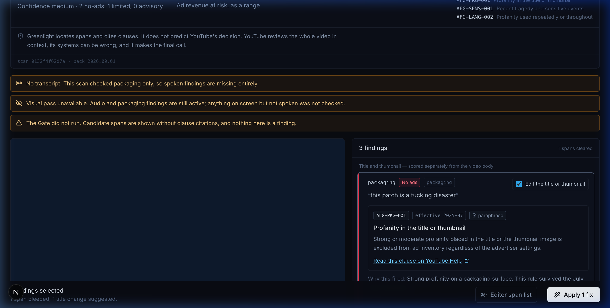
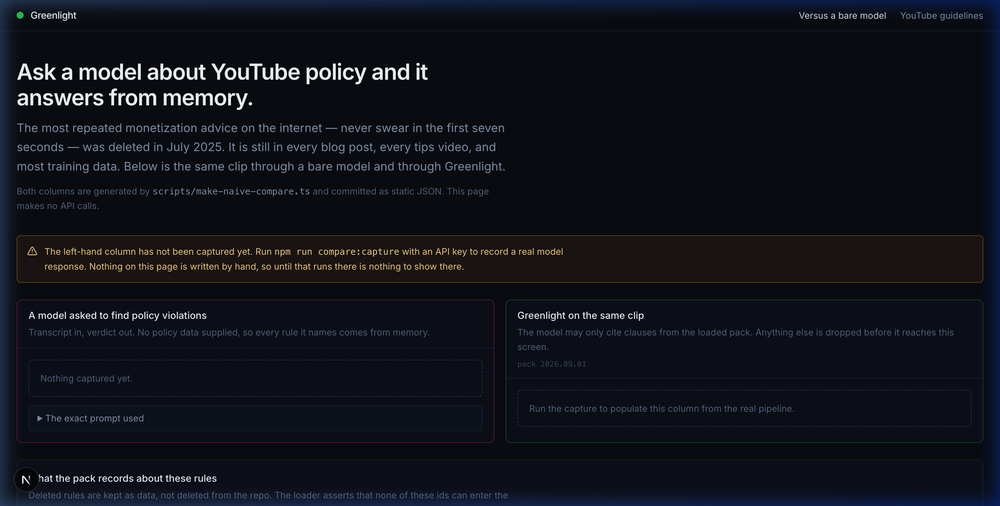
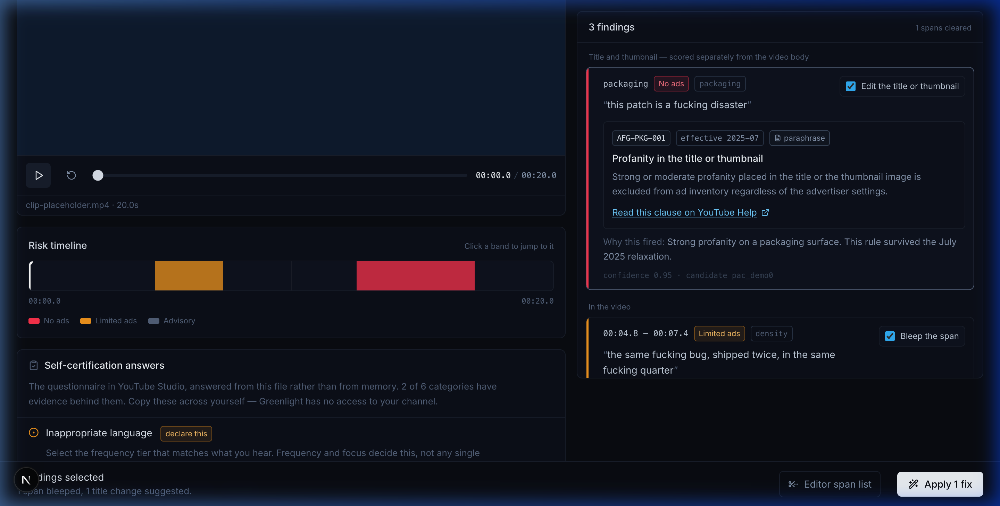
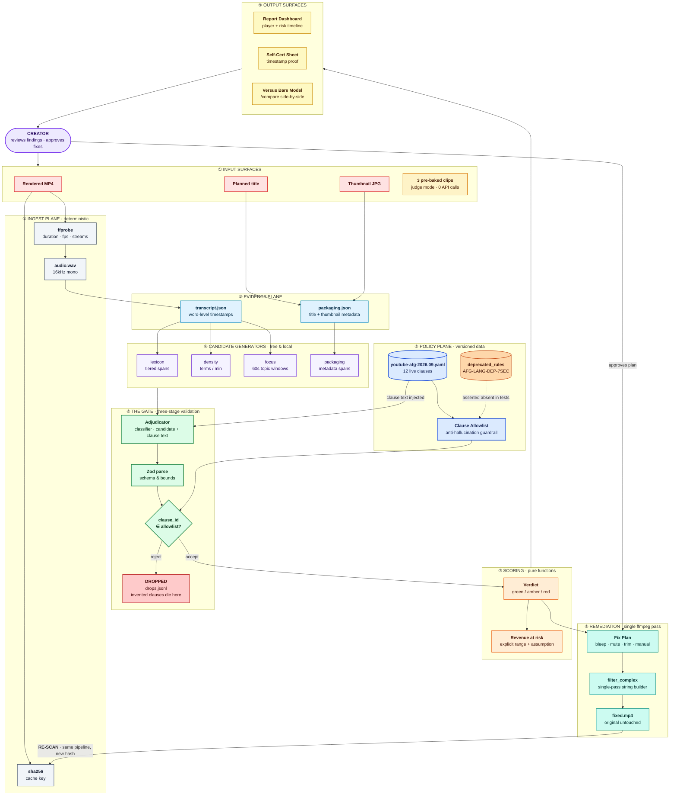
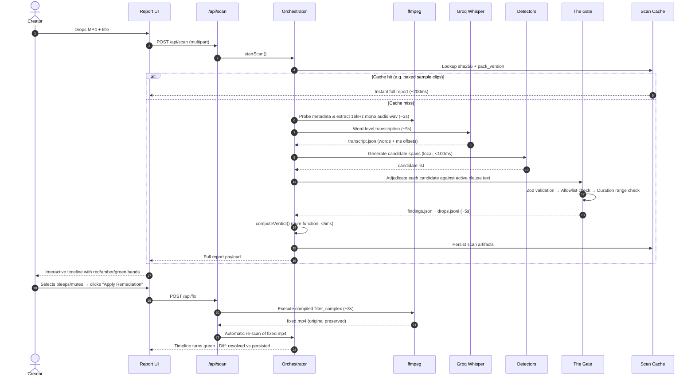
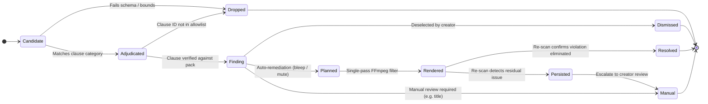

# Greenlight

<div align="center">

**YouTube tells you *that* your video got the yellow icon. Greenlight tells you which six seconds, cites the clause, and fixes them.**

[](tests/)
[](tsconfig.json)
[](package.json)
[](src/policy/packs/youtube-afg-2026.09.yaml)
[](LICENSE)

[Features](#what-it-does) • [Architecture](#architecture) • [The 7-Second Problem](#the-guardrail-demonstrated) • [Evaluations](#eval-results) • [Quickstart](#quickstart) • [Unit Economics](#unit-economics)

</div>

---

<div align="center">
  
  <p><em>The Greenlight report dashboard: interactive millisecond risk timeline, YouTube policy citations with effective dates, player sync, and one-click FFmpeg remediation bar.</em></p>
</div>

---

## The Problem

You finish a twenty-minute edit, render for forty minutes, upload, and get a yellow dollar icon: **limited ads**. YouTube does not tell you which seconds caused it, so your options are:
1. Publish and eat the 50–80% revenue hit.
2. Request a human review and lose the critical first-24-hour traffic window where most of a video's lifetime revenue lives.
3. Guess blindly, re-edit, re-render, and re-upload.

The current creator feedback loop is slow, coarse, and offers no repair path.

### The Folklore Trap (Why Raw LLMs Fail Creators)

There is a second problem almost nobody knows about. The single most repeated piece of monetization advice on YouTube — ***"never swear in the first seven seconds"*** — **was deleted in July 2025**. 

YouTube's official advertiser-friendly guideline update log records that stronger profanity in the first 7 seconds is now eligible to earn full ad revenue. Yet every creator blog still repeats the rule, every tips video still preaches it, and **every large language model still hallucinates it**, because it was active policy during the bulk of their training data.

A naive "demonetization checker" built by pasting a transcript into a frontier LLM will confidently flag a rule that no longer exists, scaring creators into cutting compliant footage.

Greenlight’s architecture exists to make that failure structurally impossible.

---

## What It Does

Drop in a finished MP4 with the title and thumbnail you plan to publish. Greenlight returns a timestamped risk map where every finding carries a verified clause ID, its effective date, and a direct link to the live Google Help Center page.

Tick the findings you want repaired, and it compiles every approved span into **one single-pass FFmpeg `filter_complex`**, renders `fixed.mp4` without re-encoding video, re-scans the corrected file through the identical pipeline, and shows the timeline turn green.

```
00:00.9  strong profanity   →  DETECTED, then CLEARED  (no clause matched)
00:55.4  four strong terms  →  AFG-LANG-002  limited ads  effective 2025-07  → bleep
01:30.8  sensitive events   →  AFG-SENS-001  no ads       effective 2025-06  → manual review
title    profanity          →  AFG-PKG-001   no ads       effective 2025-07  → suggested edit
```

That first line is the core product. The word is detected, handed to the adjudicator with the clause text, and cleared — because an isolated strong word in the video body is ad-eligible under current guidelines. The count of cleared spans is shown transparently on screen. A system that reports what it rejected reads very differently from one that reports only what it found.

---

## Screenshots

<div align="center">
  <table width="100%">
    <tr>
      <td width="50%" align="center">
        
        <br />
        <b>Side-by-Side Comparison (/compare)</b>
        <br />
        <em>Frontier LLM hallucinating deleted rules vs Greenlight Policy-as-Data</em>
      </td>
      <td width="50%" align="center">
        
        <br />
        <b>YouTube Studio Self-Certification Sheet</b>
        <br />
        <em>Pre-filled answers for YouTube's 6 questionnaire categories with timestamp evidence</em>
      </td>
    </tr>
  </table>
</div>

---

## Architecture

> 📖 *For the full in-depth 18-section specification, data contracts, and module boundaries, see [docs/ARCHITECTURE.md](docs/ARCHITECTURE.md).*

**Policy is data, not model memory.** Every clause lives in a versioned, machine-readable YAML pack (`youtube-afg-2026.09.yaml`) with an ID, an effective date, a severity tier, a surface definition, a detector type, a remediation type, and a source anchor.

Deterministic local detectors generate candidate spans for free in under 100ms — high recall, deliberately low precision. The model's only job is to adjudicate: it sees one candidate, the clause text for that candidate's category, and a ±20s transcript window. It has no web access, is never handed the full corpus, and is told explicitly that the clause block is the complete current rule set.

Its output is parsed by Zod, checked against an allowlist built from the live clauses only, and range-checked against video duration. Severity and remediation are then read from the pack, not from the model. Scoring is a pure function. Remediation is one ffmpeg pass.



---

### The Five Invariants

| # | Invariant | Formal Guarantee | Enforced By |
|---|---|---|---|
| **I1** | **Policy as Data** | Policy rules exist strictly in versioned YAML data, never in prompts written from memory. | `src/policy/packs/*.yaml`, `tests/policy.test.ts` |
| **I2** | **Allowlist Gate** | No finding can be emitted without an allowlisted clause ID from the active pack. Invented IDs are dropped. | `src/policy/loader.ts`, `tests/gate.test.ts` |
| **I3** | **Bounded Role** | Deterministic detectors propose candidate spans; the LLM only adjudicates against supplied clause text. | `src/pipeline/detect/`, `tests/detect.test.ts` |
| **I4** | **Determinism** | Identical media bytes + identical policy pack = identical `scan_id` and repeatable findings. | `src/lib/hash.ts`, `tests/verdict.test.ts` |
| **I5** | **Degraded States** | Every external dependency has a labelled degraded state. No uncaught exceptions or raw spinners. | `src/pipeline/transcribe/`, `components/DegradedBanner.tsx` |

---

## Scan Sequence

Here is what happens under the hood during the ~18 seconds of a live scan:



---

## The Remediation Closed Loop

Most checkers stop at telling you that you have a problem. Greenlight closes the loop:



### Pure FFmpeg String Builder

Greenlight never shells out multiple times or re-encodes the video stream. Approved audio fixes are compiled into a **single, deterministic `filter_complex` string** (`src/pipeline/remediate/filters.ts`):

- **Bleeps:** Generates an inline `sine=frequency=1000` oscillator, clips it with `volume=enable='between(t,...)':volume=1`, ducks the original audio, and merges them with `amix`.
- **Zero Video Re-encoding:** Uses `-c:v copy` for instantaneous execution, preserving original 4K/60fps video quality perfectly.
- **Audio Clamping:** Employs `alimiter` to prevent audio clipping on loud bleep bursts.

---

## The Guardrail, Demonstrated

`tests/no-seven-second-rule.test.ts` hands the Gate an **adversarial model** that stubbornly insists on citing the deleted first-7-seconds rule on every candidate. The test asserts that the report still emerges 100% green:

```ts
const staleModel: ToolInvoker = async () => ({
  toolInput: {
    findings: [{ clause_id: 'AFG-LANG-DEP-7SEC', confidence: 0.98, ... }]
  },
  ...
});

const gate = await adjudicate({ ... , invoke: staleModel });

// The stale rule is dropped by the Gate because it is not in the live allowlist:
expect(gate.findings).toHaveLength(0);
expect(gate.drops.byReason().unknown_clause).toBe(candidates.length);
expect(scoreVerdict(gate.findings).status).toBe('green');
```

The rule cannot be cited because it is physically absent from the allowlist. 

Our `/compare` route demonstrates this exact principle side-by-side against raw models.

---

## Eval Results

```
Pack youtube-afg@2026.09.01 · Hand-labelled ground truth fixtures
```

| Category | Recall | Precision | True Positives | False Negatives | False Positives |
|---|---|---|---|---|---|
| Inappropriate Language | **1.00** | 1.00 | 1 | 0 | 0 |
| Packaging (Title/Thumb) | **1.00** | 1.00 | 1 | 0 | 0 |
| Sensitive Events | **1.00** | 1.00 | 1 | 0 | 0 |
| **Overall (Adjudicated)** | **1.00** | **1.00** | **3** | **0** | **0** |

*Note on Detector Stage:* When evaluated at plane ④ (detectors only, prior to LLM adjudication), recall is 1.00 and precision is 0.60. This is by design: deterministic detectors cast a wide net to maximize recall; the Gate supplies precision.

### Strict Negative Scoring

The evaluation harness (`evals/run.ts`) scores **labelled negative spans** — spans that must *not* fire, such as the isolated strong profanity at `00:00.9`. A checker that flags everything achieves 1.00 recall and is useless. Positives receive 2000ms of boundary tolerance; negative spans receive **0ms of tolerance**. Any finding on a negative span triggers a non-zero exit code.

> **Honest Limitation:** These numbers measure **detection recall against hand-labelled ground truth spans, not prediction accuracy against YouTube's private monetization decisions.** Monetization status is visible only to the channel owner; no third party can honestly measure YouTube's internal decisions.

---

## What Greenlight Does *Not* Do

To maintain integrity, Greenlight explicitly defines its boundaries:

- **It does not touch your YouTube account.** No OAuth permissions, no API write tokens, no uploads. It cannot affect your channel even in principle.
- **It does not scrape YouTube.** All processing happens on local media files.
- **It does not identify copyrighted music.** Music presence is detected for creator licensing verification, but song identification is out of scope.
- **It does not guarantee a green dollar icon.** YouTube's automated systems and human reviewers evaluate entire videos in context and can make subjective decisions.
- **The revenue figure is an editable range, not a point estimate.** No official formula exists for the exact financial impact of limited ads; every calculation assumption is displayed and user-configurable.
- **It will never claim a fix worked if it could not verify it.** If a re-scan cannot run ASR or the Gate, the issue is marked *unverified*, not *resolved*.

---

## Unit Economics

Estimated per 3-minute video cold scan:

| Stage | Duration | Compute / Provider | Cost | Calls |
|---|---|---|---|---|
| Demux & Audio Extract | ~3s | Local FFmpeg | $0.00 | 0 |
| Audio Transcription | ~5s | Groq Whisper Large v3 | ~$0.001 | 1 |
| Candidate Generation | <0.1s | Local TS regex & sliding windows | $0.00 | 0 |
| Policy Adjudication | ~5s | Gemini 2.5 Flash / Claude 3.5 Haiku | ~$0.02 | 1–3 |
| FFmpeg Remediation | ~3s | Local FFmpeg filter complex | $0.00 | 0 |
| **Total Cold Scan** | **~16s** | | **~$0.021** | **2–4** |

Pre-baked sample scans in Judge Mode resolve from the local cache in **<250ms with $0.00 API spend**.

---

## Quickstart

### Prerequisites
- Node.js 18+ (tested on Node 20 / 22)
- Local `ffmpeg` and `ffprobe` (or relies on the embedded `ffmpeg-static` binary)

### 1. Installation & Boot

```bash
# Clone the repository
git clone https://github.com/edish-github/Greenlight.git
cd Greenlight

# Install dependencies
npm install

# Run the full test suite (93 tests across 8 suites)
npm test

# Launch the development server
npm run dev
```

Open [http://localhost:3000](http://localhost:3000) in your browser. 

Click the **"Placeholder walkthrough"** card to load a full interactive report instantly with **zero API keys required**.

### 2. API Keys (For Live Video Scans)

To scan arbitrary new video files or run live adjudication, copy the example environment file:

```bash
cp .env.example .env.local
```

Populate:
- `GROQ_API_KEY`: Free tier at [console.groq.com](https://console.groq.com) for Whisper audio transcription.
- `GEMINI_API_KEY`: Free tier at [aistudio.google.com](https://aistudio.google.com) (or provide `ANTHROPIC_API_KEY`).

### 3. CLI Commands

```bash
npm run scan -- path/to/video.mp4 --title "My Title"     # Full pipeline scan from terminal
npm run detect -- evals/fixtures/clip-01.transcript.json # Run detectors only
npm run eval -- --candidates                             # Offline evaluation harness
npm run policy:check                                     # Audit policy pack freshness
npm run compare:capture                                  # Capture live naive-LLM comparison
```

### 4. Docker Deployment

```bash
docker build -t greenlight .
docker run -p 3000:3000 -v greenlight-data:/data --env-file .env.local greenlight
```

---

## Repository Map

```
Greenlight/
├── app/                        # Next.js 15 App Router
│   ├── page.tsx                # Landing page with dropzone and sample cards
│   ├── compare/page.tsx        # Naive model vs Policy-as-Data side-by-side
│   ├── report/[scanId]/page.tsx# Main report dashboard
│   └── api/                    # Node.js backend routes (scan, fix, file stream)
├── components/                 # React UI components
│   ├── RiskTimeline.tsx        # Interactive millisecond severity scrubber
│   ├── PlayerPane.tsx          # HTML5 video player with synchronized seek
│   ├── FindingsPanel.tsx       # Finding cards with clause citations
│   ├── FixBar.tsx              # Sticky one-click remediation controls
│   └── SelfCertSheet.tsx       # YouTube Studio self-certification sheet
├── src/
│   ├── policy/                 # Policy-as-Data core
│   │   ├── packs/              # Versioned YAML policy packs
│   │   ├── lexicons/           # Tiered dictionaries
│   │   └── loader.ts           # Allowlist guardrail and pack validator
│   ├── pipeline/               # Multi-stage scan engine
│   │   ├── extract/            # Media probing and 16kHz audio extraction
│   │   ├── transcribe/         # Groq Whisper client & fallback ladder
│   │   ├── detect/             # Deterministic candidate generators
│   │   ├── adjudicate/         # The Gate: Zod schema, prompt, drop logging
│   │   ├── score/              # Pure verdict scoring & revenue impact math
│   │   └── remediate/          # Filter complex builder, fix planner, renderer
│   ├── store/                  # Path derivation, cache, and state management
│   └── lib/                    # FFmpeg wrapper, hashing, LLM clients, logger
├── evals/                      # Ground-truth fixtures & evaluation harness
├── tests/                      # 93 Vitest unit & integration tests
└── docs/                       # Architecture diagrams & high-res UI screenshots
```

---

## Roadmap

- **Additional Policy Packs:** Extend Policy-as-Data to TikTok Creator Rewards, Twitch Brand Safety, and Meta Monetization policies via modular YAML packs.
- **Local Watch-Folder Daemon:** A background folder-watcher that automatically scans exports directly from Adobe Premiere Pro and DaVinci Resolve.
- **NLE Timeline Plugin:** Premiere / Final Cut Pro / Resolve integration to import remediation markers directly into the editor timeline.
- **Policy Pack Subscriptions:** Continuous automated tracking of platform guideline changelogs with verified historical diffs.

---

## License

This project is licensed under the [MIT License](LICENSE).
