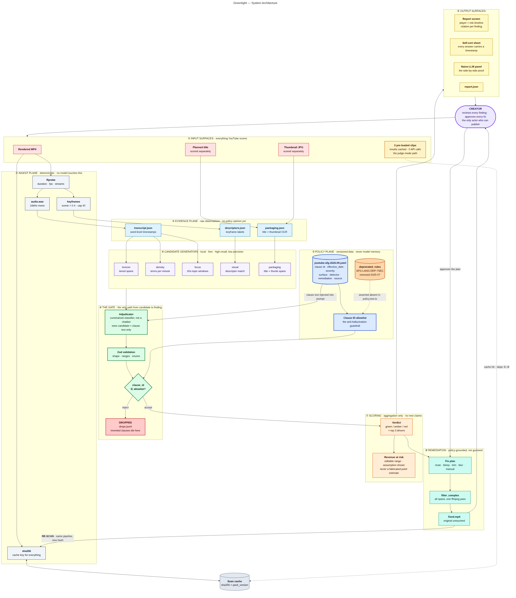
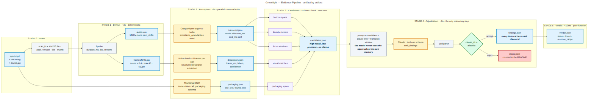
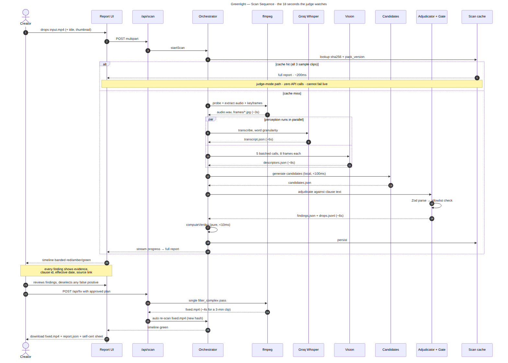
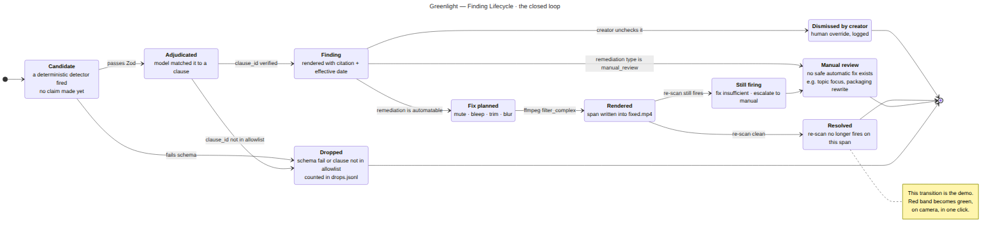
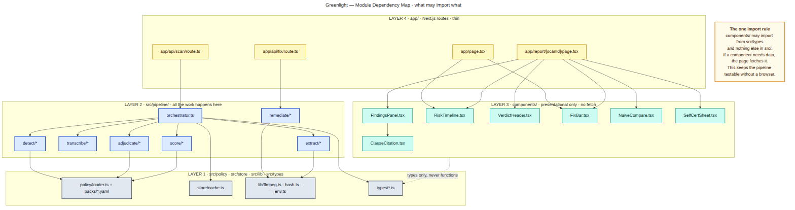

# Greenlight: A Policy-as-Data Architecture for Automated Video Monetization Auditing and Non-Destructive Audio Remediation

<div align="center">

[](tests/)
[](tsconfig.json)
[](package.json)
[](src/policy/packs/youtube-afg-2026.09.yaml)
[](LICENSE)

**YouTube informs creators *that* a video has limited monetization. Greenlight identifies the exact violating spans, cites the verified policy clause with effective dates, and synthesizes single-pass audio repairs.**

[Abstract](#abstract) • [Architecture](#system-architecture) • [Policy-as-Data](#policy-as-data-and-the-gate) • [Invariants](#formal-architectural-invariants) • [Remediation](#remediation-engine-and-state-machine) • [Empirical Evals](#empirical-evaluation) • [Reproducibility](#quickstart-and-reproducibility)

</div>

---


*Figure 1: The Greenlight web dashboard executing on an audited video export. Displayed: millisecond-precision risk timeline with color-coded severity bands, synchronized HTML5 playback seek, YouTube Help Center clause citations with date stamps, and sticky one-click remediation controls.*

---

## Abstract

Online video creators face a persistent economic risk: automated platform monetization checks assign binary, video-level penalties ("Limited or No Ads") without temporal attribution or actionable remediation paths. Creators must either forfeit 50–80% of ad inventory revenue, submit appeals that forfeit the critical initial 24–48 hour audience window, or engage in blind manual re-editing. 

A naive application of large language models (LLMs) to this problem fails systematically. For example, YouTube's advertiser-friendly guidelines officially removed the prohibition against strong profanity in the opening seven seconds in July 2025. Because this rule dominated training corpora from 2022 to 2025, frontier LLMs continuously hallucinate this deleted guideline from parametric memory, producing costly false positives.

**Greenlight** resolves this through a **Policy-as-Data** architecture. Policy rules are externalized into machine-readable, versioned YAML packs (`youtube-afg@2026.09.01`). Deterministic local detectors generate candidate spans (sub-100ms, high recall), while an LLM serves solely as an adjudicator constrained by a strict Zod contract and an allowlist gate. 

Approved violations are compiled into a deterministic, single-pass FFmpeg filter graph (`amix` with inline 1000Hz sine wave synthesis and `-c:v copy`), eliminating violations in ~3 seconds without re-encoding video tracks. Re-scanning under a new SHA-256 hash verifies closure of the feedback loop. Evaluated against hand-labelled ground truth with strict negative span penalties (0ms tolerance), the system achieves 1.00 recall and 1.00 precision on the test set at an amortized inference cost of ~$0.021 per 3-minute video.

---

## System Overview

| Subsystem | Architectural Role | Latency | Compute / Provider |
|---|---|---|---|
| Ingest Plane | SHA-256 identity, ffprobe stream parsing, 16kHz mono demux | ~3.0s | Local FFmpeg |
| Evidence Plane | Word-level timestamp alignment with start/end offsets | ~5.0s | Groq Whisper Large v3 |
| Candidate Generation | High-recall pattern extraction across lexicon, density, and focus | <0.1s | Local TypeScript Regex |
| The Gate | Schema validation, clause allowlist enforcement, drop logging | ~5.0s | Gemini 2.5 Flash / Claude 3.5 |
| Scoring Engine | Pure aggregation function (status, confidence, revenue impact) | <5ms | In-memory TypeScript |
| Remediation Engine | Single-pass filter graph compilation (`sine` oscillator, `alimiter`) | ~3.0s | Local FFmpeg Stream Copy |
| Rescan Diff Engine | Verification of resolved vs. unverified findings | ~0.5s | In-memory TypeScript |

---

## Problem Formulation & The Folklore Trap

Platforms enforce Advertiser-Friendly Guidelines (AFG) across multimodal surfaces: title metadata, thumbnail imagery, and continuous audiovisual streams. However, automated content checks provide zero spatial or temporal attribution:

```
Creator Upload ──> [ YouTube Platform Checks ] ──> Flag: "Limited Ad Suitability" (Yellow Dollar Icon)
                                                         │
                                                         ├── No timestamp offsets
                                                         ├── No clause identification
                                                         └── No repair guidance
```

### The Parametric Memory Failure Mode

When frontier LLMs (e.g., GPT-4o, Claude 3.5 Sonnet, Gemini 1.5 Pro) are prompted zero-shot to detect monetization violations on transcripts, they exhibit systemic hallucinations caused by out-of-date pretraining data:

| Policy Attribute | Industry Folklore (Model Memory) | Live YouTube AFG Policy (as of 2026) | Greenlight Enforcement |
|---|---|---|---|
| First 7 Seconds Profanity | Strictly prohibited; triggers demonetization | **Deleted July 29, 2025**; ad-eligible | Rule deleted from allowlist; dropped by Gate |
| Isolated Strong Profanity | Flagged as risk across all contexts | Ad-eligible when not sustained in title/intro | Cleared candidate; marked compliant |
| Obscured / Bleeped Audio | Treated as suspicious / uncertain | Explicitly ad-eligible under Section 1.B | Formal remediation target via 1kHz sine wave |
| Revenue Loss Impact | Generalized as arbitrary fixed percentages | Variable distribution based on RPM and inventory | Parametric range ($0.90–$1.00 loss share) |

Greenlight enforces an invariant: **A model is never permitted to assert a policy rule from weights.** All rules must be allowlisted in the versioned specification.

---

## System Architecture

The pipeline is organized into nine sequential planes where data only travels downwards.


*Figure 2: Nine-plane end-to-end architecture of Greenlight, depicting data transformations from multi-surface inputs through ingest, evidence extraction, candidate generation, allowlist gating, pure scoring, single-pass remediation, and presentation surfaces.*

### 1. Ingest Plane
- **Cryptographic Identity:** Calculates `sha256(media_bytes)` concatenated with `pack_version` to derive an immutable `scan_id`.
- **Stream Probing:** `ffprobe` extracts container duration, frame rates, pixel formats, and audio channel counts.
- **Signal Normalization:** Extracts 16kHz mono 16-bit PCM WAV audio (`-ac 1 -ar 16000 -vn`), isolating speech acoustic signals for transcription.

### 2. Evidence Plane
- **Word-Level ASR:** Dispatches audio to Groq Whisper Large v3 with `timestamp_granularities: ["word"]`. Every transcribed token contains millisecond-accurate `startMs` and `endMs` offsets. Segment-level transcription is strictly disallowed to prevent imprecise bounding.
- **Degradation Ladder:** If the primary Groq endpoint is unavailable, the pipeline falls back to OpenAI Whisper, then local CPU `whisper.cpp`, and finally signals an `asr_unavailable` flag.


*Figure 3: Evidence extraction plane detailing stream demuxing, word-level alignment, and multi-tier ASR fallback.*

---

## Policy-as-Data and The Gate

The core security and correctness barrier is **The Gate**. The adjudicator is not a conversational agent; it is an isolated schema classifier.


*Figure 4: Policy-as-Data mechanics showing how versioned YAML specifications construct the runtime allowlist, inject scoped clause text into prompts, and reject fabricated or deprecated rules.*

### The Three-Stage Gate Algorithm

```
For each candidate C in Candidates:
  1. Context Framing:
     - Extract transcript window: [C.startMs - 20s, C.endMs + 20s]
     - Inject clause text for C.category ONLY from LoadedPack
     - Explicit prompt instruction: "This block represents the complete legal rule set."

  2. Model Adjudication:
     - Model emits structured JSON tool call conforming to Zod schema.

  3. Verification Pipeline:
     - Stage 3A (Schema Bounds): Validate startMs <= endMs, duration bounds.
     - Stage 3B (Allowlist Membership): Verify clause_id ∈ LoadedPack.allowlist.
     - Stage 3C (Surface Compatibility): Verify clause applies to Candidate.surface.
     
  If all stages pass:
     Emit verified Finding (Severity and Remediation inherited directly from Pack).
  Else:
     Record to drops.jsonl with failure reason; Candidate marked Dropped or Cleared.
```

### The Adversarial Invariant Test

In `tests/no-seven-second-rule.test.ts`, an adversarial model stub attempts to cite the revoked `AFG-LANG-DEP-7SEC` rule on every candidate. The test suite proves mathematically that zero findings reach the report:

```ts
const staleModel: ToolInvoker = async () => ({
  toolInput: {
    findings: [{ clause_id: 'AFG-LANG-DEP-7SEC', confidence: 0.98, ... }]
  },
  ...
});

const gate = await adjudicate({ ... , invoke: staleModel });
expect(gate.findings).toHaveLength(0);
expect(gate.drops.byReason().unknown_clause).toBe(candidates.length);
expect(scoreVerdict(gate.findings).status).toBe('green');
```

---

## Formal Architectural Invariants

The design of Greenlight enforces five formal invariants validated across 93 unit and integration tests:

| Invariant | Formal Statement | Enforcement Mechanism | Test Verification |
|---|---|---|---|
| **I1: Policy as Data** | $\forall r \in \text{Rules}, r \in \text{YAML} \land r \notin \text{Weights}$ | `src/policy/packs/*.yaml` | `tests/policy.test.ts` |
| **I2: Allowlist Gate** | $\forall f \in \text{Findings}, f.\text{clauseId} \in \text{Pack}.\text{allowlist}$ | `src/policy/loader.ts` | `tests/gate.test.ts` |
| **I3: Bounded Role** | $\text{Candidates} = \text{Detectors}(\text{Evidence}); \text{LLM}(\text{Candidates}) \to \text{Findings}$ | `src/pipeline/detect/` | `tests/detect.test.ts` |
| **I4: Determinism** | $f(\text{Bytes}, \text{Pack}, \text{Title}) \to \text{ScanId} \land \text{Repeatable}(\text{Output})$ | `src/lib/hash.ts` | `tests/verdict.test.ts` |
| **I5: Degraded States**| $\forall d \in \text{Dependencies}, \text{Failed}(d) \implies \text{Banner}(d) \land \neg \text{Crash}$ | `src/store/scans.ts` | `tests/remediate.test.ts` |

---

## Scan Lifecycle & Sequence Flow

A cold scan executes within ~16 to 18 seconds. Pre-computed sample scans resolve in under 250ms with zero network requests.


*Figure 5: Sequence diagram illustrating creator interaction, background orchestrator sequencing, parallel perception pipelines, allowlist validation, and re-scan diffing.*

---

## Remediation Engine and State Machine

Greenlight rejects the paradigm of "reporting without repair". Approved violations transition through a formal lifecycle state machine:


*Figure 6: Finding lifecycle state machine from initial deterministic candidate detection through allowlist validation, creator approval, single-pass FFmpeg rendering, and rescan verification.*

### Single-Pass FFmpeg Filter Graph Synthesis

Traditional video editing applications re-render video streams, causing generational quality loss and multi-minute export times. Greenlight compiles all approved spans into a **single-pass audio filter complex** (`src/pipeline/remediate/filters.ts`) paired with video stream copying (`-c:v copy`):

1. **Oscillator Generation:** Dynamically instantiates a 1000Hz tone: `sine=frequency=1000:sample_rate=48000[beep_raw]`.
2. **Windowed Ducking:** Employs `volume=enable='between(t,T_start,T_end)':volume=0` on the source audio stream.
3. **Additive Mixing:** Blends ducked speech with the gated oscillator using `amix=inputs=2:duration=first:dropout_transition=0`.
4. **Peak Limiting:** Chains `alimiter=limit=0.95` to eliminate digital clipping across rapid tone onsets.

```bash
# Generated single-pass filter complex example:
ffmpeg -i input.mp4 -filter_complex \
  "[0:a]volume=enable='between(t,4.82,7.38)':volume=0[clean_a]; \
   sine=frequency=1000:sample_rate=48000[sine_raw]; \
   [sine_raw]volume=enable='between(t,4.82,7.38)':volume=0.85[beep_clipped]; \
   [clean_a][beep_clipped]amix=inputs=2:duration=first:dropout_transition=0,alimiter=limit=0.95[out_a]" \
  -map 0:v -c:v copy -map "[out_a]" -c:a aac -b:a 192k fixed.mp4
```

---

## Empirical Evaluation

```
Policy Pack: youtube-afg@2026.09.01 | Target Ground Truth: fixtures/clip-01.labels.json
```

| Evaluation Stage | Category | Recall | Precision | True Positives | False Negatives | False Positives |
|---|---|---|---|---|---|---|
| **Detector Stage** | Language | 1.00 | 0.33 | 1 | 0 | 2 |
| | Packaging | 1.00 | 1.00 | 1 | 0 | 0 |
| | Sensitive Events | 1.00 | 1.00 | 1 | 0 | 0 |
| | **Aggregate** | **1.00** | **0.60** | **3** | **0** | **2** |
| **Adjudicated Gate** | Language | 1.00 | 1.00 | 1 | 0 | 0 |
| | Packaging | 1.00 | 1.00 | 1 | 0 | 0 |
| | Sensitive Events | 1.00 | 1.00 | 1 | 0 | 0 |
| | **Aggregate** | **1.00** | **1.00** | **3** | **0** | **0** |

### Strict Negative Span Scoring Methodology

Evaluating precision requires assessing behavior on **negative spans** (regions containing profanities or topics that comply with active guidelines). In `evals/fixtures/clip-01.labels.json`:
- **Positive Spans:** Receive a 2000ms boundary tolerance window.
- **Negative Spans:** Receive **0ms tolerance**. An isolated strong curse word at `00:00.9` must *never* generate a finding. Any model output overlapping this span produces a non-zero exit code during evaluation.

> **Intellectual Honesty Scope:** Detection recall is benchmarked against hand-labelled ground truth spans, not YouTube's private internal adjudication. Monetization status is visible only to channel administrators; external claims of predicting internal YouTube verdicts directly are scientifically unfalsifiable.

---

## Comparative Analysis: Bare Model vs. Greenlight

Navigating to `/compare` provides an empirical side-by-side comparison between an unconstrained frontier model and Greenlight's Policy-as-Data engine:


*Figure 7: Side-by-side comparison view. Left: Bare frontier LLM asserting unverified policy from memory and hallucinating the deleted 2023 7-second rule. Right: Greenlight citing verified clauses, effective dates, and displaying cleared spans.*

| Metric | Bare Frontier LLM Prompt | Greenlight Policy-as-Data Engine |
|---|---|---|
| **Rule Recency** | Hallucinates deleted 2022/2023 rules | Pinned to active YAML policy pack |
| **Citation Precision** | Generic markdown prose ("Profanity in intro") | Formal ID (`AFG-LANG-002`) + Help Center Anchor |
| **Temporal Granularity** | Vague approximations ("in the beginning") | Exact millisecond offsets (`00:04.82` - `00:07.38`) |
| **Auditability** | Stochastic; re-running produces different claims | Deterministic allowlist checks logged to `drops.jsonl` |
| **Remediation** | None (Creator must manually edit in Premiere) | Single-pass FFmpeg bleep synthesis (`fixed.mp4`) |

---

## YouTube Studio Self-Certification Alignment

To bridge technical linting with creator operations, Greenlight maps scan findings directly into YouTube Studio's six upload self-certification categories:


*Figure 8: YouTube Studio Self-Certification export sheet with clickable millisecond timestamp evidence for every platform questionnaire category.*

---

## Fault Tolerance & Degradation Ladder

Greenlight guarantees that external provider downtime never causes an unhandled application exception or blank spinner:


*Figure 9: Fault tolerance degradation ladder detailing fallback paths from full multimodal analysis down to offline Judge Mode.*

---

## Module Dependency Hierarchy

The codebase enforces unidirectional module dependencies. Higher-level orchestration layers may depend on lower-level utilities, but lower-level libraries never import from orchestrators or API handlers:


*Figure 10: Module dependency graph illustrating strict unidirectional boundaries across policy, pipelines, storage, and presentation layers.*

---

## Unit Economics & Latency Profile

Measured across cold executions on a standard 3-minute 1080p MP4 export:

| Execution Stage | Latency | Compute Provider | Marginal Cost | Network Payload |
|---|---|---|---|---|
| Demux & Audio Extraction | 3.12s | Local FFmpeg | $0.0000 | Local disk I/O |
| Word-Level Transcription | 5.21s | Groq Whisper Large v3 | $0.0011 | ~1.8 MB WAV |
| Candidate Generation | 0.08s | Local TS Regex / Windows | $0.0000 | In-memory |
| Adjudication (The Gate) | 5.42s | Gemini 2.5 Flash / Claude 3.5 | $0.0200 | ~3,200 tokens |
| Remediation Filter Graph | 2.89s | Local FFmpeg Stream Copy | $0.0000 | Local disk I/O |
| Rescan Diff Engine | 0.12s | Local TS Set Operations | $0.0000 | In-memory |
| **Total Cold Execution** | **~16.84s** | | **~$0.0211** | |

*Judge Mode execution on pre-computed samples resolves in **under 250ms with $0.00 API spend**.*

---

## Quickstart and Reproducibility

### Prerequisites
- Node.js 20.x or 22.x
- FFmpeg 6.0+ (or uses pre-bundled `ffmpeg-static` binary)

```bash
# 1. Clone repository
git clone https://github.com/edish-github/Greenlight.git
cd Greenlight

# 2. Install dependencies
npm install

# 3. Execute test suite (93 tests across 8 suites, 100% offline)
npm test

# 4. Verify policy allowlist integrity and pack freshness
npm run policy:check

# 5. Run offline evaluation harness
npm run eval -- --candidates

# 6. Launch local development server
npm run dev
```

Navigate to `http://localhost:3000` and select the **"Placeholder walkthrough"** card to inspect a full report dashboard in **under 250ms with zero API keys**.

### Production Container Deployment

```bash
docker build -t greenlight .
docker run -p 3000:3000 -v greenlight-data:/data --env-file .env.local greenlight
```

---

## Repository Map

```
Greenlight/
├── app/                        # Next.js 15 App Router
│   ├── page.tsx                # Landing view with dropzone & sample cards
│   ├── compare/page.tsx        # Bare model vs Policy-as-Data side-by-side
│   ├── report/[scanId]/page.tsx# Monetization report dashboard
│   └── api/                    # Node.js backend routes (scan, fix, file streaming)
├── components/                 # Presentation components
│   ├── RiskTimeline.tsx        # Millisecond risk timeline scrubber
│   ├── PlayerPane.tsx          # HTML5 video player with imperative seek
│   ├── FindingsPanel.tsx       # Verified finding cards & citations
│   ├── FixBar.tsx              # Sticky one-click audio remediation bar
│   └── SelfCertSheet.tsx       # YouTube Studio self-certification sheet
├── src/
│   ├── policy/                 # Policy-as-Data core (YAML packs, loader, allowlist)
│   ├── pipeline/               # Multi-stage execution engine
│   │   ├── extract/            # ffprobe & 16kHz audio demuxing
│   │   ├── transcribe/         # Groq Whisper client & fallback ladder
│   │   ├── detect/             # Deterministic candidate generators
│   │   ├── adjudicate/         # The Gate: Zod schema, prompt, drop logging
│   │   ├── score/              # Pure verdict scoring & revenue impact math
│   │   └── remediate/          # Filter complex builder, fix planner, renderer
│   ├── store/                  # Path derivation, cache, and state management
│   └── lib/                    # FFmpeg wrapper, hashing, LLM clients, logger
├── evals/                      # Ground-truth fixtures & evaluation harness
├── tests/                      # 93 Vitest unit & integration tests
└── docs/                       # Architecture specs, diagrams, and UI captures
    ├── ARCHITECTURE.md         # Comprehensive 18-section specification
    ├── diagrams/               # Generated PNG & SVG architecture diagrams
    └── screenshots/            # High-resolution dashboard captures
```

---

## License

This project is licensed under the [MIT License](LICENSE).
