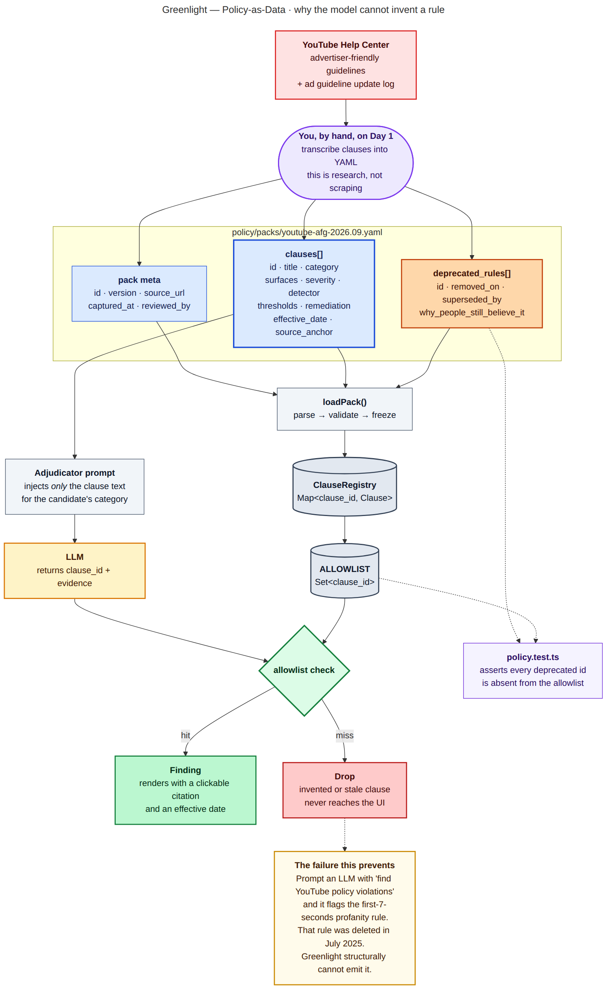
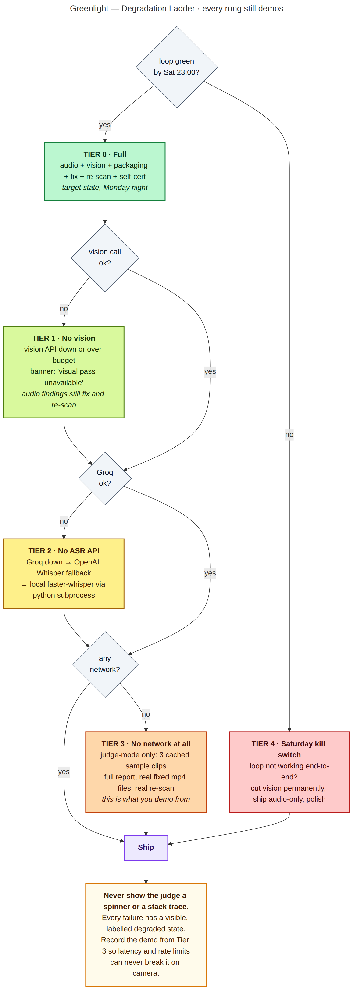

# Greenlight — System Architecture

Version 1.0 · captured 3 Sept 2026 · target ship 8 Sept 2026

All diagrams in this document exist as Mermaid source (`diagrams/src/*.mmd`), rendered SVG (`diagrams/svg/`) and rendered PNG (`diagrams/png/`). Mermaid is embedded inline so the doc renders on GitHub without external assets.

---

## Table of contents

1. [Architectural invariants](#1-architectural-invariants)
2. [Stack decisions](#2-stack-decisions)
3. [System architecture](#3-system-architecture)
4. [The evidence pipeline](#4-the-evidence-pipeline)
5. [Policy-as-data](#5-policy-as-data)
6. [The Gate](#6-the-gate)
7. [Scan sequence](#7-scan-sequence)
8. [Finding lifecycle](#8-finding-lifecycle)
9. [The remediation engine](#9-the-remediation-engine)
10. [Data contracts](#10-data-contracts)
11. [Directory structure](#11-directory-structure)
12. [Directory guide](#12-directory-guide)
13. [Module dependency rules](#13-module-dependency-rules)
14. [Caching and state](#14-caching-and-state)
15. [Failure modes and the degradation ladder](#15-failure-modes-and-the-degradation-ladder)
16. [Cost, latency and rate-limit budget](#16-cost-latency-and-rate-limit-budget)
17. [Legal and safety boundaries](#17-legal-and-safety-boundaries)
18. [Testing and the eval harness](#18-testing-and-the-eval-harness)

---

## 1. Architectural invariants

Five rules. Every one of them exists to protect a scoring criterion. If a design decision violates one, the decision is wrong.

| # | Invariant | Protects |
|---|---|---|
| **I1** | **Policy lives in versioned data, never in a prompt written from memory or in model weights.** | Correctness, technical execution |
| **I2** | **A finding cannot exist without a clause ID that is present in the loaded pack's allowlist.** | Anti-hallucination, auditability |
| **I3** | **Cheap deterministic detectors generate candidates; the model only adjudicates.** | Cost, latency, precision |
| **I4** | **The pipeline is a pure function of `(file bytes, pack version, title, thumbnail)`.** Same inputs, same `scan_id`, same output. | Caching, reproducibility, demo reliability |
| **I5** | **Every external dependency has a labelled degraded state. No spinner, no stack trace, ever.** | Demo reliability, functionality score |

---

## 2. Stack decisions

| Layer | Choice | Why this and not the alternative |
|---|---|---|
| App framework | **Next.js 15, App Router, TypeScript** | One runtime, one deploy, one language. A separate Python FastAPI worker would be architecturally cleaner and would cost you a day you do not have. |
| Runtime | **Node, `export const runtime = 'nodejs'`** on every API route | Edge runtime cannot spawn ffmpeg. Set this explicitly or you will lose two hours to a confusing error. |
| Media | **`ffmpeg-static` + `fluent-ffmpeg`** | Ships the binary in `node_modules`. No system install, no Docker surprise, works identically on your laptop and in the container. |
| ASR | **Groq `whisper-large-v3-turbo`**, `timestamp_granularities: ["word"]` | Fastest hosted Whisper with word-level output. Word timestamps are non-negotiable — the entire product is span-level. |
| ASR fallback | OpenAI Whisper → local `faster-whisper` via subprocess | Ladder tiers 2 and 3. |
| Reasoning | **Claude Sonnet, tool-use schema** | Structured output enforced at the API layer rather than by hoping a model formats JSON correctly. |
| Vision | Same model, image content blocks, 8 frames per call | One SDK, one auth path, one failure mode to handle. |
| Validation | **Zod** | Parses model output at the boundary. Anything that fails the schema is dropped and counted, never coerced. |
| Client state | **Zustand** | Report screen has real state (selected finding, player position, checkbox set). Prop-drilling that through five components will cost you an hour on Sunday. |
| Styling | **Tailwind** | Speed. |
| Persistence | **Filesystem JSON, keyed by `scan_id`** | No database. A DB buys you nothing in a 5-day single-user tool and costs schema migrations you cannot afford. |
| Deploy | **Docker → Railway** (primary) · static judge-mode on Vercel (fallback) | Vercel serverless functions will fight ffmpeg and long requests. Railway runs a plain container. |

---

## 3. System architecture


*Source: [`diagrams/src/01-system-architecture.mmd`](diagrams/src/01-system-architecture.mmd) · [SVG](diagrams/svg/01-system-architecture.svg)*

The system is nine planes, and data only ever moves downward through them.

| Plane | Responsibility | Determinism |
|---|---|---|
| ① **Input surfaces** | MP4, title, thumbnail, sample clips. Title and thumbnail are separate surfaces because YouTube scores them separately from the video body. | — |
| ② **Ingest** | Hash, probe, audio extraction, scene-change keyframes. | Fully deterministic. No model touches this plane. |
| ③ **Evidence** | Transcript with word timestamps, keyframe descriptors, packaging text. Raw observations carrying no policy opinion. | Probabilistic (ASR, vision) but makes no claims. |
| ④ **Candidate generators** | Local, free, sub-100ms. High recall, deliberately low precision. | Fully deterministic. |
| ⑤ **Policy plane** | The versioned YAML pack, the clause registry, and the allowlist. The source of truth. | Static data. |
| ⑥ **The Gate** | The single path from candidate to finding. Adjudicator → Zod → allowlist check. | The only reasoning step in the system. |
| ⑦ **Scoring** | Aggregation into a verdict and a revenue range. Makes no new claims. | Pure function. |
| ⑧ **Remediation** | Fix plan → one `filter_complex` → `fixed.mp4` → re-scan. | Fully deterministic. |
| ⑨ **Output surfaces** | Report screen, self-cert sheet, naive-LLM panel, `report.json`. | — |

The creator sits outside every plane and commits every value: they approve findings, approve the fix plan, and are the only actor who can publish.

---

## 4. The evidence pipeline


*Source: [`diagrams/src/02-evidence-pipeline.mmd`](diagrams/src/02-evidence-pipeline.mmd) · [SVG](diagrams/svg/02-evidence-pipeline.svg)*

Six stages, each producing a named artifact that is written to the scan directory. Every artifact is inspectable, which makes debugging on Saturday night tractable.

```
scans/<scan_id>/
├── input.mp4
├── meta.json          # probe output, pack version, timings
├── audio.wav
├── frames/000.jpg …   # ≤ 40
├── transcript.json    # STAGE 2
├── descriptors.json   # STAGE 2
├── packaging.json     # STAGE 2
├── candidates.json    # STAGE 3
├── findings.json      # STAGE 4
├── drops.jsonl        # STAGE 4 — rejected model output
├── verdict.json       # STAGE 5
├── fixplan.json       # STAGE 6
└── fixed.mp4
```

### Key extraction parameters

```bash
# audio
-vn -acodec pcm_s16le -ar 16000 -ac 1

# keyframes — scene change, not uniform sampling
-vf "select='gt(scene,0.4)',scale=512:-1" -vsync vfr -frames:v 40
```

Scene-change selection instead of uniform sampling is the difference between 40 frames that each show something new and 40 frames that show the same talking head forty times. It also bounds vision cost independent of video length.

---

## 5. Policy-as-data



*Source: [`diagrams/src/03-policy-as-data.mmd`](diagrams/src/03-policy-as-data.mmd) · [SVG](diagrams/svg/03-policy-as-data.svg)*

### Pack schema

```yaml
pack:
  id: youtube-afg
  version: "2026.09.01"
  source_url: https://support.google.com/youtube/answer/6162278
  update_log_url: https://support.google.com/youtube/answer/9725604
  captured_at: 2026-09-04
  captured_by: ambrstack
  note: >
    Transcribed by hand from the live help centre. Not scraped.
    Re-read the update log before bumping version.

clauses:
  - id: AFG-LANG-002
    title: Profanity used repeatedly or throughout
    category: inappropriate_language
    surfaces: [video_body]
    detector: density
    severity: limited_ads
    effective_date: "2025-07"
    thresholds:
      strong_terms_per_minute: 4
      share_of_sentences_affected: 0.30
    remediation: bleep
    source_anchor: "#inappropriate-language"
    clause_text: >
      Content where profanity is the focus, or is used repeatedly or
      throughout, may not be suitable for all advertisers.

  - id: AFG-PKG-001
    title: Profanity in title or thumbnail
    category: inappropriate_language
    surfaces: [title, thumbnail]
    detector: lexicon
    severity: no_ads
    effective_date: "2025-07"
    thresholds:
      tiers: [strong, moderate]
    remediation: packaging_edit
    source_anchor: "#inappropriate-language"
    clause_text: >
      Profanity in the title or thumbnail image is excluded from ad
      inventory regardless of advertiser settings.

deprecated_rules:
  - id: AFG-LANG-DEP-7SEC
    title: Strong profanity in the first 7 seconds
    removed_on: "2025-07"
    superseded_by: [AFG-LANG-002]
    why_people_still_believe_it: >
      In force from Nov 2022 to Jul 2025 and repeated across every creator
      blog and tips video. Present in most LLM training data. This is the
      single most common false positive in naive policy checkers.
```

### Loading and the guardrail

```ts
// src/policy/loader.ts
export function loadPack(path: string): LoadedPack {
  const raw = parseYaml(readFileSync(path, 'utf8'));
  const pack = PackSchema.parse(raw);                  // Zod, throws on malformed
  const registry = new Map(pack.clauses.map(c => [c.id, c]));
  const allowlist = new Set(registry.keys());

  for (const dep of pack.deprecated_rules) {
    if (allowlist.has(dep.id)) {
      throw new Error(`Deprecated clause ${dep.id} is live in the pack`);
    }
  }
  return Object.freeze({ pack, registry, allowlist });
}
```

**I2 in code.** Deprecated IDs cannot be in the allowlist, and `policy.test.ts` asserts it independently. This is the specific mechanism that makes it structurally impossible for Greenlight to emit the dead 7-second rule, and it is worth thirty seconds of your demo video.

---

## 6. The Gate

The adjudicator sees three things and nothing else: the candidate, the clause text for that candidate's category, and a ±20-second transcript window for context. It does not have web access, it is not asked what it knows about YouTube policy, and it is never handed the full policy corpus.

### Prompt contract

```
SYSTEM
You are a policy adjudicator. You will be given a candidate span detected by a
deterministic detector, and the exact text of one or more policy clauses.

Decide whether the candidate matches a clause. Emit a finding ONLY if it does.

Rules:
- You may only cite clause IDs that appear in the CLAUSES block below.
- If no clause matches, return an empty findings array. This is a normal and
  frequent outcome.
- A single mention of a sensitive term is not a match for a density or focus
  clause. Those require sustained presence.
- Do not reason from your own knowledge of platform policy. The CLAUSES block
  is the complete and current set of rules. Anything not in it does not exist.

CLAUSES
{{injected clause objects, id + title + clause_text + thresholds}}

CANDIDATE
{{detector, span, evidence, computed metrics}}

TRANSCRIPT WINDOW
{{±20s}}
```

The final rule in that block is the one that matters. It closes the door on the model importing a deleted rule from its training data.

### Output tool schema

```ts
const FindingOut = z.object({
  clause_id:   z.string(),
  surface:     z.enum(['video_body','title','thumbnail','audio']),
  start_ms:    z.number().int().nonnegative(),
  end_ms:      z.number().int().nonnegative(),
  evidence:    z.string().max(300),
  severity:    z.enum(['no_ads','limited_ads','advisory']),
  confidence:  z.number().min(0).max(1),
  rationale:   z.string().max(400),
});

const EmitFindings = z.object({ findings: z.array(FindingOut).max(25) });
```

### Three-stage rejection

```ts
const parsed = EmitFindings.safeParse(toolInput);
if (!parsed.success) return drop('schema', toolInput);

for (const f of parsed.data.findings) {
  if (!allowlist.has(f.clause_id))        drop('unknown_clause', f);
  else if (f.end_ms <= f.start_ms)        drop('bad_span', f);
  else if (f.end_ms > durationMs)         drop('out_of_range', f);
  else accept(f);
}
```

Every drop is appended to `drops.jsonl` with its reason. The aggregate drop count goes in the README, because a system that reports what it rejected reads very differently from one that reports only what it found.

---

## 7. Scan sequence


*Source: [`diagrams/src/04-scan-sequence.mmd`](diagrams/src/04-scan-sequence.mmd) · [SVG](diagrams/svg/04-scan-sequence.svg)*

Note the cache-hit branch at the top. The three sample clips resolve entirely from cache in ~200ms and make **zero external API calls**. That path is what the demo video is recorded from, which means neither latency nor a rate limit nor a downed provider can break the demo.

---

## 8. Finding lifecycle


*Source: [`diagrams/src/05-remediation-state.mmd`](diagrams/src/05-remediation-state.mmd) · [SVG](diagrams/svg/05-remediation-state.svg)*

`Rendered → Resolved` is the transition the judge watches. Note that `Rendered → Persisted` exists too: if the re-scan still fires on a span, the UI says so honestly and escalates the item to manual review. Hiding that case would be the kind of dishonesty a skeptical judge is specifically looking for.

---

## 9. The remediation engine

### Remediation types

| Type | ffmpeg approach | Applies to |
|---|---|---|
| `mute` | `volume=enable='between(t,S,E)':volume=0` | Any audio span |
| `bleep` | 1kHz tone via `sine`, mixed with `amix`, gated to the span | Profanity spans |
| `trim` | Segment select + concat | Whole removable moments |
| `blur_region` | `crop` → `boxblur` → `overlay`, gated by `enable=between` | Visual findings with a bounding box |
| `packaging_edit` | None. Returns suggested replacement text. | Title, thumbnail |
| `manual_review` | None. | Topic focus, density, anything with no safe local fix |

### One pass, not N passes

All approved spans compile into a single `filter_complex`. Re-encoding a 3-minute clip once takes ~4 seconds; re-encoding it five times takes twenty and looks bad on camera.

```ts
// src/pipeline/remediate/filters.ts
export function buildFilterComplex(plan: FixPlan): string {
  const mutes  = plan.items.filter(i => i.type === 'mute'  || i.type === 'bleep');
  const blurs  = plan.items.filter(i => i.type === 'blur_region');

  const volume = mutes
    .map(i => `volume=enable='between(t,${s(i)},${e(i)})':volume=0`)
    .join(',');

  const bleeps = plan.items.filter(i => i.type === 'bleep');
  // sine source + amix, gated per span
  ...
  return [audioChain, videoChain].filter(Boolean).join(';');
}
```

Write `filters.ts` as a **pure string builder with unit tests** and no ffmpeg invocation. You can then iterate on the filter graph without waiting on encodes, which is the difference between fixing this in twenty minutes and losing an evening to it.

---

## 10. Data contracts

```ts
// src/types/scan.ts
export type ScanId = string;  // sha256(fileBytes + packVersion + title + thumbHash)

export type ScanStatus =
  | 'queued' | 'demuxing' | 'transcribing' | 'visual'
  | 'detecting' | 'adjudicating' | 'scoring' | 'complete' | 'failed';

export interface Scan {
  id: ScanId;
  createdAt: string;
  status: ScanStatus;
  packVersion: string;
  durationMs: number;
  degraded: DegradedFlag[];        // e.g. ['visual_unavailable']
  timings: Record<string, number>;
  parentScanId?: ScanId;           // set on a re-scan; links fixed → original
}

export type DegradedFlag =
  | 'visual_unavailable'
  | 'asr_fallback_openai'
  | 'asr_fallback_local'
  | 'packaging_skipped';
```

```ts
// src/types/finding.ts
export type Surface  = 'video_body' | 'title' | 'thumbnail' | 'audio';
export type Severity = 'no_ads' | 'limited_ads' | 'advisory';
export type Remediation =
  | 'mute' | 'bleep' | 'trim' | 'blur_region'
  | 'packaging_edit' | 'manual_review';

export interface Finding {
  id: string;
  clauseId: string;                // guaranteed ∈ allowlist
  clauseTitle: string;
  clauseText: string;
  effectiveDate: string;           // shown in the UI — this is the trust signal
  sourceUrl: string;               // deep link to the live help centre page
  surface: Surface;
  startMs: number;
  endMs: number;
  evidence: string;
  evidenceType: 'transcript' | 'keyframe' | 'packaging';
  keyframePath?: string;
  severity: Severity;
  confidence: number;
  rationale: string;
  remediation: Remediation;
  detector: string;                // which candidate generator fired
  state: 'open' | 'dismissed' | 'planned' | 'resolved' | 'persisted';
}
```

```ts
// src/types/verdict.ts
export interface Verdict {
  status: 'green' | 'amber' | 'red';
  drivers: string[];               // finding ids, max 3
  confidence: 'low' | 'medium' | 'high';
  revenueAtRisk: {
    low: number; high: number;
    assumption: string;            // rendered verbatim in the UI
    editable: true;
  };
  disclaimer: string;              // always rendered, never dismissible
}
```

The `disclaimer` field being part of the data contract rather than a UI decision is deliberate. It cannot be forgotten, restyled away, or lost in a refactor at 2am on Monday.

---

## 11. Directory structure

```
greenlight/
├── README.md                          ← the judge reads this. write it Tuesday, not never.
├── LICENSE
├── .env.example
├── Dockerfile
├── next.config.ts
├── tailwind.config.ts
├── tsconfig.json
├── package.json
│
├── docs/
│   ├── 01-PRODUCT-CONCEPT.md
│   ├── 02-ARCHITECTURE.md
│   ├── 03-IMPLEMENTATION-PLAN.md
│   ├── 04-MASTER-CHECKLIST.md
│   └── diagrams/
│       ├── src/*.mmd
│       ├── svg/*.svg
│       └── png/*.png
│
├── app/                               ← Next.js App Router. THIN. no logic.
│   ├── layout.tsx
│   ├── globals.css
│   ├── page.tsx                       ← landing: dropzone + 3 sample cards
│   ├── report/[scanId]/page.tsx       ← the screen that wins the hackathon
│   ├── compare/page.tsx               ← naive-LLM side-by-side panel
│   └── api/
│       ├── scan/route.ts              ← POST multipart → scanId
│       ├── scan/[scanId]/route.ts     ← GET status + report (polled)
│       ├── fix/route.ts               ← POST fix plan → fixed.mp4 + rescan
│       └── file/[scanId]/[name]/route.ts  ← serves mp4/jpg from the scan dir
│
├── src/
│   ├── pipeline/
│   │   ├── orchestrator.ts            ← the only place stages are sequenced
│   │   ├── extract/
│   │   │   ├── probe.ts
│   │   │   ├── audio.ts
│   │   │   └── keyframes.ts
│   │   ├── transcribe/
│   │   │   ├── index.ts               ← provider selection + fallback ladder
│   │   │   ├── groq.ts
│   │   │   ├── openai.ts
│   │   │   └── local.ts
│   │   ├── vision/
│   │   │   ├── describe.ts            ← batched keyframe → descriptors
│   │   │   └── ocr.ts                 ← thumbnail text
│   │   ├── detect/
│   │   │   ├── index.ts               ← runs all generators, merges candidates
│   │   │   ├── lexicon.ts
│   │   │   ├── density.ts
│   │   │   ├── focus.ts
│   │   │   ├── visual.ts
│   │   │   └── packaging.ts
│   │   ├── adjudicate/
│   │   │   ├── adjudicate.ts          ← the Gate
│   │   │   ├── prompt.ts
│   │   │   ├── schema.ts              ← Zod contracts for model output
│   │   │   └── drops.ts
│   │   ├── score/
│   │   │   ├── verdict.ts             ← pure function. unit tested.
│   │   │   └── revenue.ts
│   │   └── remediate/
│   │       ├── plan.ts                ← findings → FixPlan
│   │       ├── filters.ts             ← pure string builder. unit tested.
│   │       └── render.ts              ← the single ffmpeg invocation
│   │
│   ├── policy/
│   │   ├── loader.ts
│   │   ├── types.ts
│   │   ├── lexicons/
│   │   │   └── en-tiered.json         ← strong / moderate / mild
│   │   └── packs/
│   │       └── youtube-afg-2026.09.yaml
│   │
│   ├── store/
│   │   ├── paths.ts                   ← every path in the app derives from here
│   │   ├── cache.ts
│   │   └── scans.ts
│   │
│   ├── lib/
│   │   ├── ffmpeg.ts                  ← the ONLY module that spawns ffmpeg
│   │   ├── hash.ts
│   │   ├── env.ts                     ← validated at boot, fails loudly
│   │   ├── llm.ts                     ← Anthropic client + retry + timeout
│   │   └── logger.ts
│   │
│   └── types/
│       ├── scan.ts
│       ├── finding.ts
│       ├── verdict.ts
│       └── fixplan.ts
│
├── components/                        ← presentational only. no fetch. no src/ imports except types.
│   ├── Dropzone.tsx
│   ├── SampleClips.tsx
│   ├── ScanProgress.tsx               ← the stage list, not a spinner
│   ├── PlayerPane.tsx
│   ├── RiskTimeline.tsx               ← ⭐ the signature component
│   ├── VerdictHeader.tsx
│   ├── FindingsPanel.tsx
│   ├── FindingCard.tsx
│   ├── ClauseCitation.tsx             ← ⭐ id + effective date + source link
│   ├── FixBar.tsx
│   ├── BeforeAfter.tsx
│   ├── SelfCertSheet.tsx
│   ├── NaiveCompare.tsx
│   └── DegradedBanner.tsx
│
├── evals/
│   ├── fixtures/                      ← hand-labelled ground truth
│   │   ├── clip-01.labels.json
│   │   └── …
│   ├── run.ts                         ← npm run eval
│   └── RESULTS.md                     ← pasted into the README
│
├── scripts/
│   ├── precompute-samples.ts          ← ⭐ bakes the 3 judge-mode clips
│   ├── make-fixture.ts
│   └── check-policy-freshness.ts
│
├── public/
│   └── samples/                       ← 3 clips + thumbs + cached reports
│
└── tests/
    ├── policy.test.ts                 ← deprecated ids absent from allowlist
    ├── filters.test.ts                ← filter_complex string builder
    ├── verdict.test.ts                ← scoring is a pure function
    └── gate.test.ts                   ← invented clause id is dropped
```

---

## 12. Directory guide

| Path | Owns | Do **not** put here |
|---|---|---|
| `app/` | Routing, request parsing, response shaping. Should be thin enough to read in one sitting. | Any pipeline logic. If a route body exceeds ~40 lines it belongs in `src/`. |
| `app/api/*/route.ts` | HTTP boundary. **Every file needs `export const runtime = 'nodejs'`.** | ffmpeg calls, model calls. |
| `src/pipeline/` | All the work. Testable with zero browser and zero Next.js. | React, DOM, anything importing from `app/` or `components/`. |
| `src/pipeline/orchestrator.ts` | The single place stages are sequenced and timed. One file to read to understand the whole flow. | Stage implementations. |
| `src/policy/` | The source of truth. Data plus a loader plus a guardrail. | Detection logic, prompts, UI strings. |
| `src/policy/packs/` | Versioned YAML. Filename carries the version. | Never edit a shipped pack in place — add a new dated file and bump the reference. |
| `src/store/paths.ts` | Every filesystem path in the app. | Hard-coded paths anywhere else. This file is why the Docker deploy will not surprise you. |
| `src/lib/ffmpeg.ts` | The only module allowed to spawn a process. | Business logic. |
| `src/types/` | Shared contracts. The one thing `components/` may import from `src/`. | Functions, constants, anything with a runtime cost. |
| `components/` | Rendering and local UI state only. | `fetch`, filesystem access, model calls, policy loading. Pages fetch; components render. |
| `evals/` | Ground truth and the scoring harness. | Product code. |
| `scripts/` | One-shot developer tooling. | Anything the running app imports. |
| `public/samples/` | The three judge-mode clips, their thumbnails, and their pre-computed reports. | Large source footage. Keep the repo clonable. |
| `tests/` | The four tests that defend the four invariants. | Exhaustive coverage. You have five days. |

---

## 13. Module dependency rules


*Source: [`diagrams/src/06-module-map.mmd`](diagrams/src/06-module-map.mmd) · [SVG](diagrams/svg/06-module-map.svg)*

Four layers, and imports only ever point downward.

```
app/          → components/, src/pipeline/, src/types/
components/   → src/types/          ONLY
src/pipeline/ → src/policy/, src/store/, src/lib/, src/types/
src/policy/   → src/types/, src/lib/
src/lib/      → nothing internal
```

The rule that earns its keep is **`components/` may import types and nothing else**. It keeps the entire pipeline testable from a plain Node script, which is what lets you debug Saturday night without a browser in the loop.

---

## 14. Caching and state

`scan_id = sha256(fileBytes ‖ packVersion ‖ title ‖ thumbHash)`

Because of invariant I4, the same inputs always produce the same ID, which gives you three things for free:

1. **Re-runs are instant.** Iterating on the report UI does not re-burn API credits.
2. **The three sample clips are pre-baked.** `scripts/precompute-samples.ts` runs the full pipeline once, commits the resulting scan directories to `public/samples/`, and the app serves them from cache. Zero API calls at demo time.
3. **A pack version bump invalidates correctly.** Change the policy and every scan re-runs, automatically and without a manual cache flush.

A re-scan of `fixed.mp4` produces a different hash and therefore a different scan, linked to the original by `parentScanId`. That link is what powers the before/after view.

---

## 15. Failure modes and the degradation ladder



*Source: [`diagrams/src/07-degradation-ladder.mmd`](diagrams/src/07-degradation-ladder.mmd) · [SVG](diagrams/svg/07-degradation-ladder.svg)*

| Failure | Detection | Behaviour | User sees |
|---|---|---|---|
| Vision API error or timeout | try/catch, 30s timeout | Skip plane ③ visual, continue with audio | Amber banner: *Visual pass unavailable — audio and packaging findings only* |
| Groq down or rate-limited | HTTP status | Fall back to OpenAI Whisper, then local | Grey note: *Transcribed with fallback provider* |
| Model returns malformed JSON | Zod `safeParse` | Retry once, then drop the batch | Nothing. Logged to `drops.jsonl`. |
| Model invents a clause ID | Allowlist check | Drop | Nothing. Counted. |
| ffmpeg render fails | Non-zero exit | Original preserved, error surfaced | Red banner with the actual stderr tail |
| No network at all | Boot check | Sample clips still fully functional | *Offline — sample clips available* |

**The rule:** never a spinner, never a stack trace. Every failure has a visible, labelled state. Record the demo from tier 3 (cached samples) so latency and rate limits can never break it on camera.

---

## 16. Cost, latency and rate-limit budget

Per 3-minute clip, cold:

| Stage | Time | Cost | Calls |
|---|---|---|---|
| Demux | ~3s | 0 | 0 |
| Transcribe | ~6s | ~$0.001 | 1 |
| Vision | ~8s | ~$0.04 | 5 (8 frames each) |
| Candidates | <0.1s | 0 | 0 |
| Adjudicate | ~6s | ~$0.02 | 1–3 |
| Verdict | <0.01s | 0 | 0 |
| **Total** | **~23s** | **~$0.06** | **7–9** |

Fix render adds ~4s and zero cost. Re-scan is a full second pass, so budget ~$0.12 for a complete scan-fix-rescan cycle.

**Rate-limit protection:** vision calls are batched 8 frames per request and capped at 40 frames total regardless of video length, so a 60-minute video costs exactly the same as a 3-minute one. Cap uploads at 15 minutes in the UI anyway. Put the $0.06 figure in the README — judges notice cost awareness, and almost no hackathon project can state its unit economics.

---

## 17. Legal and safety boundaries

- **Local file upload is the primary input.** No YouTube scraping, no ToS exposure.
- **No OAuth, no channel access, no writes to any platform.** Greenlight cannot touch the creator's account even in principle.
- **The original file is never modified.** `fixed.mp4` is always a new file.
- **Scans are local to the deployment** and deletable from the UI.
- **Sample clips must be footage you own or that is clearly licensed.** Record them yourself. Fifteen minutes of work that removes a whole category of risk from a public submission.
- **Policy text is quoted briefly and attributed with a source link**, never reproduced wholesale.

---

## 18. Testing and the eval harness

### The four tests that defend the four invariants

| Test | Asserts | Invariant |
|---|---|---|
| `policy.test.ts` | Every `deprecated_rules` ID is absent from the allowlist. Every clause has an `effective_date` and a `source_anchor`. | I1, I2 |
| `gate.test.ts` | A fabricated clause ID in mock model output is dropped and logged. | I2 |
| `filters.test.ts` | A known fix plan compiles to the expected `filter_complex` string. No ffmpeg spawned. | I5 |
| `verdict.test.ts` | Scoring is a pure function; same findings always give the same verdict. | I4 |

### The eval harness

`evals/fixtures/*.labels.json` holds hand-labelled ground truth: for each clip, the spans you know are there and the clause each should match.

```bash
npm run eval
```

```
Greenlight eval · pack youtube-afg-2026.09.01 · 30 clips · 74 labelled spans

CATEGORY                RECALL   PRECISION   FP/clip
inappropriate_language   0.91      0.86        0.30
violence                 0.78      0.81        0.23
controversial_issues     0.66      0.72        0.40
packaging                0.95      0.93        0.07
─────────────────────────────────────────────────────
OVERALL                  0.83      0.84        0.25

Dropped by the Gate: 41  (unknown_clause 12 · schema 6 · bad_span 23)
```

**State plainly what this measures.** It is *detection recall against hand-labelled spans*, not prediction accuracy against YouTube's decisions. Monetization status is private to the channel owner, so nobody can honestly measure the latter. Saying that in the README, in one sentence, is the difference between a judge trusting your numbers and a judge suspecting all of them.

Almost no hackathon project ships an eval table at all. It costs you half a day and it is the single cheapest way into the top few percent on technical execution.
